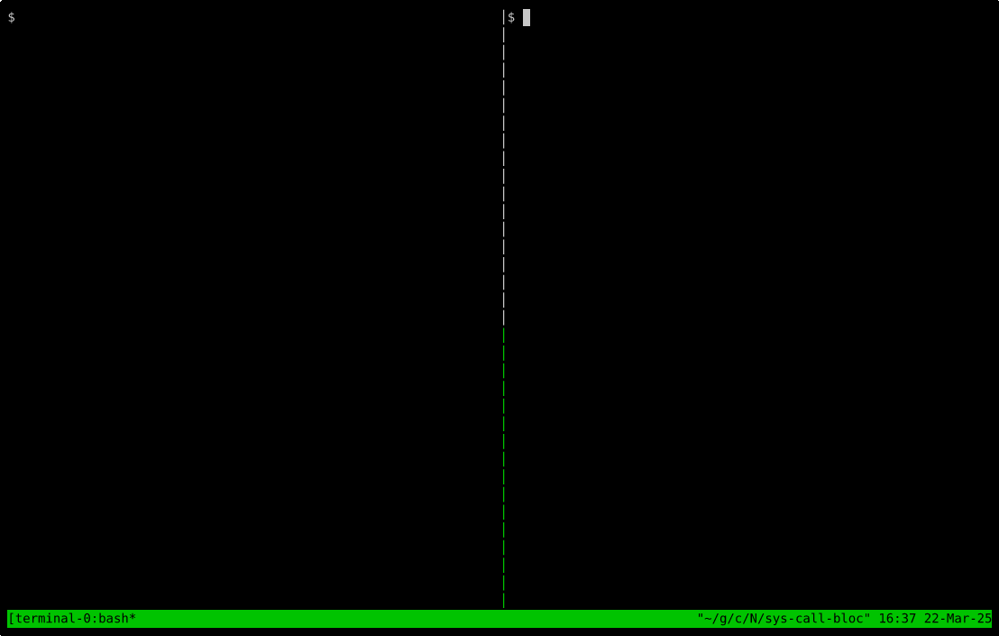

# eBPF Tools

A collection of eBPF tools that are built using libbpf in C++. The build system is written in CMake and is configured to provide a solid development experience in IDEs.

Originally submitted for the NetworkInCode hackathon by me.

## Included Tools

### Syscall Blocker

Code: [syscall-blocker](./syscall-blocker)

#### Features

- [x] **Block syscalls**: Specific system calls can be blocked by passing the syscall names as arguments to the program.
- [x] **Filter by UID**: The user can specify the UIDs for which the syscalls should be blocked.
- [x] **Filter by Mount Namespace ID**: The user can specify the mount namespace IDs for which the syscalls should be blocked.
- [x] **Logging**: The blocked syscalls are logged to the console.
- [x] **Filter by container name**: By passing the docker container name directly, the mount namespace ID is automatically fetched and the syscalls are blocked for that container.

#### Demo

### DNS Query Delay Injector

Code: [dns-delay](./dns-delay)

##### Features Implemented

- [x] **Delay Injection:** Introduce delays in DNS query packets.
- [x] **Filtering Capabilities:** Filter based on:
  - [x] **Process:** Making the DNS request. (Process Name)
  - [x] **Target URL:** Being queried.
  - [x] **DNS Server:** Handling the request.
- [x] **Delay Configuration:** Set user-defined or random delays (with jitter).
- [x] **Logging:** Provide logging for debugging and verification.

#### Demo

### ThreadViz

Code: [threadviz](./threadviz)

#### Implementation Notes

* The program uses eBPF hooks to trace thread events.
* The user-space program transforms the raw data into Perfetto trace format.
* The trace is then visualized using Perfetto UI.

#### Demo

https://github.com/user-attachments/assets/02ef1524-19d6-4015-9d67-3013355e60d4

## License

MIT License

© 2025, @CaptainIRS
