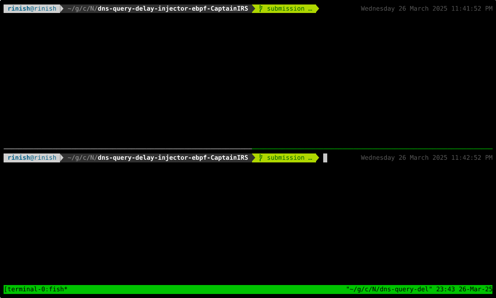

# DNS Query Delay Injector

## Features Implemented

- [x] **Delay Injection:** Introduce delays in DNS query packets.
- [x] **Filtering Capabilities:** Filter based on:
  - [x] **Process:** Making the DNS request. (Process Name)
  - [x] **Target URL:** Being queried.
  - [x] **DNS Server:** Handling the request.
- [x] **Delay Configuration:** Set user-defined or random delays (with jitter).
- [x] **Logging:** Provide logging for debugging and verification.

## Demo



## Implementation Details

* There are 2 BPF programs and an user-space control program.
* The first BPF program (proc_name_mapper) maps the process name to the process id. This is required because process name is not available in the context of the BPF program that does classification. So, this program maps the process name making network requests to the corresponding process ID and saves them in a map shared with the second BPF program.
* The second BPF program (dns_delay_injector) classifies the DNS packets based on the process id, target URL and DNS server IP. It marks the packets that need to be delayed for further processing.
* The user-space control program reads the user input and passes it to the BPF programs using the BPF maps.
* Delays are introduced using the `tc` command. The packets marked by the BPF program are matched using `tc filter` and delayed using NetEm (Network Emulation) qdisc. The delay is introduced using the `delay` parameter of NetEm. The delay is set to the value provided by the user with an additional jitter value in case random delay is required.
* Delays cannot be implemented in the BPF program itself because BPF programs are not allowed to sleep using any public API. So, the packets are marked in the BPF program and the delay is introduced in post-processing using `tc`.

## Dependencies

- Linux Kernel >= 6.10
- libbpf
- bpftool in $PATH
- clang
- cmake

## Build

```bash
mkdir build
cd build
cmake ..
cmake --build .
```

## Run

```bash
sudo ./scripts/test.sh
```

## Usage

```bash
Usage: ./scripts/test.sh [-p process_name] [-q query] [-d delay] [-j jitter] [-i dns_server_ip] [-h]
```

For example, to introduce a delay of 1s to DNS queries made by the process `dig` for the domain `example.com`:

```bash
sudo ./scripts/test.sh -p dig -q example.com -d 1s
```

In another terminal instance, run `dig example.com` to see the delay in action.

For example, to introduce a delay of 1s with jitter of 0.5s to DNS queries made by the process `nslookup` for the domain `google.com` to the DNS server `127.0.0.1`:

```bash
sudo ./scripts/test.sh -p nslookup -q google.com -d 1s -j 0.5s -i 127.0.0.1
```

In another terminal instance, run `nslookup google.com` to see the delay in action.
