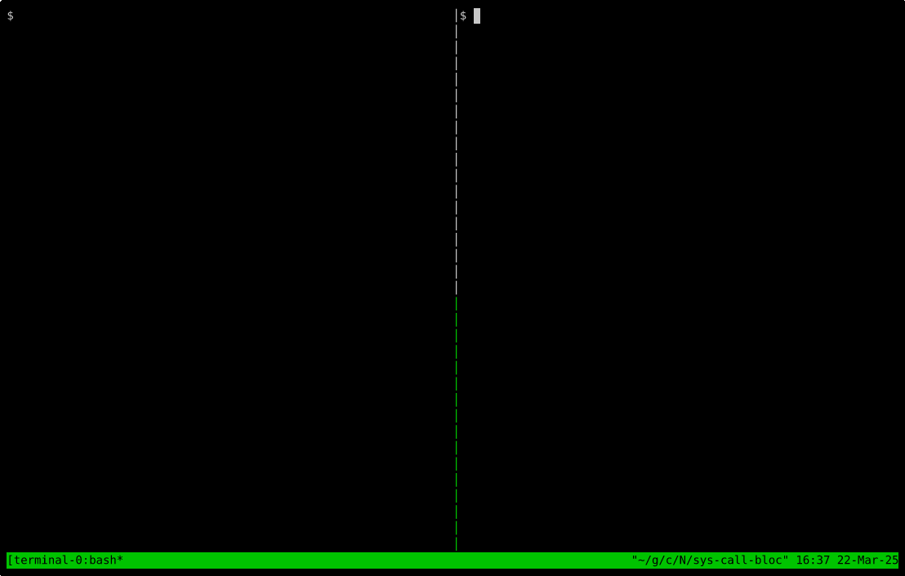

# Syscall Blocker

## Features

- [x] **Block syscalls**: Specific system calls can be blocked by passing the syscall names as arguments to the program.
- [x] **Filter by UID**: The user can specify the UIDs for which the syscalls should be blocked.
- [x] **Filter by Mount Namespace ID**: The user can specify the mount namespace IDs for which the syscalls should be blocked.
- [x] **Logging**: The blocked syscalls are logged to the console.
- [x] **Filter by container name**: By passing the docker container name directly, the mount namespace ID is automatically fetched and the syscalls are blocked for that container.

## Demo



## Implementation Details

* The implementation is done using eBPF kprobes to intercept the syscalls. The return value is set to -1 to block the syscall.
* The filtering is done by uid and the inode number of the mount namespace.
* The test program either takes in the inode number directly or the docker container name to derive the inode number.
* The program logs the blocked syscalls to the console.
* All the syscalls in the system where the program is compiled are supported.
* Code generation is used to generate the kprobes for all the syscalls.
* Only the kprobes for the syscalls that are to be blocked are loaded at runtime.

## Dependencies

- libbpf
- bpftool in $PATH
- clang
- cmake
- python3
- docker
- lsns (from util-linux package) if the container name is passed as an argument instead of the inode number.

## Build Instructions

```bash
mkdir build
cd build
cmake ..
cmake --build .
```

## Run

```bash
sudo ./syscall_blocker -h
```

```bash
Usage: ./scripts/test.sh [-u uid] [-n ns_inum] [-c container_name] [-s syscall1,syscall2,...] [-h]
```

## Usage

Start a docker container in another terminal
```
docker run --rm -it --name test alpine sh
```

Start a program in the container and get it's PID
```
sleep 1000 &
ps -a
```

Run the syscall blocker with the PID of the program in the container
```
sudo ./scripts/test.sh -c test -u 0 -s kill
```

The kill syscall will be blocked for the container.
Now try to kill the program in the container
```
kill <PID>
```

The kill syscall will be blocked and the program will not kill the process.
